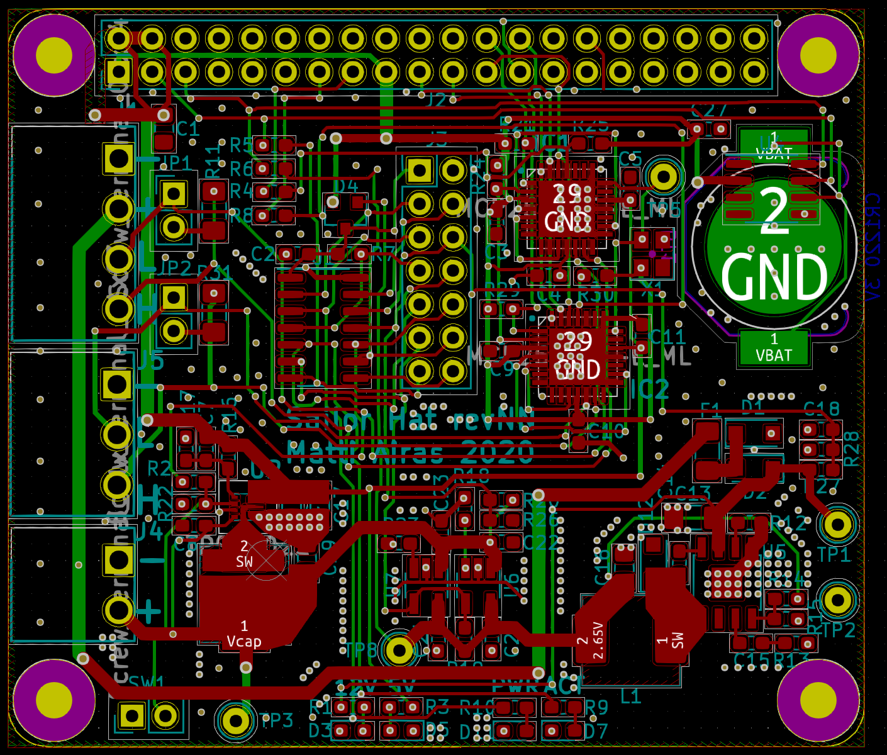

# Pi Super-UPS

## Introduction

Sailor Hat for Raspberry Pi is a Raspberry Pi power management and CAN bus
controller board for marine and automotive use. The main features are:

- Power management for 2.7V supercapacitors that provide so-called last gasp
  energy for shutting down the device in a controlled fashion after the
  system power is cut.
- Peak power management: The same supercapacitor circuitry is able to provide
  peak current for power-hungry devices such as the Raspberry Pi 4B+, allowing
  those devices to be powered using current-limited subcircuits such as the
  NMEA2000 bus power wires.
- Protection circuitry: The board is protected against noisy 12V voltages
  commonly present on vehicles or marine vessels.
- Two CAN bus controllers, allowing for different bus configurations, such as
  two separate NMEA2000 buses, an NMEA2000 and an J1939 engine bus, or in
  automotive applications, two separate vehicle CAN buses.
- A battery-powered real-time clock circuit, allowing for the device to
  keep time even in absence of GPS or networking.

This repository contains the KiCad hardware design files for Sailor Hat.
There are two other related repositories: 
[firmware](https://github.com/mairas/sailor-hat-firmware) and 
[daemon](https://github.com/mairas/sailor-hat-firmware).

