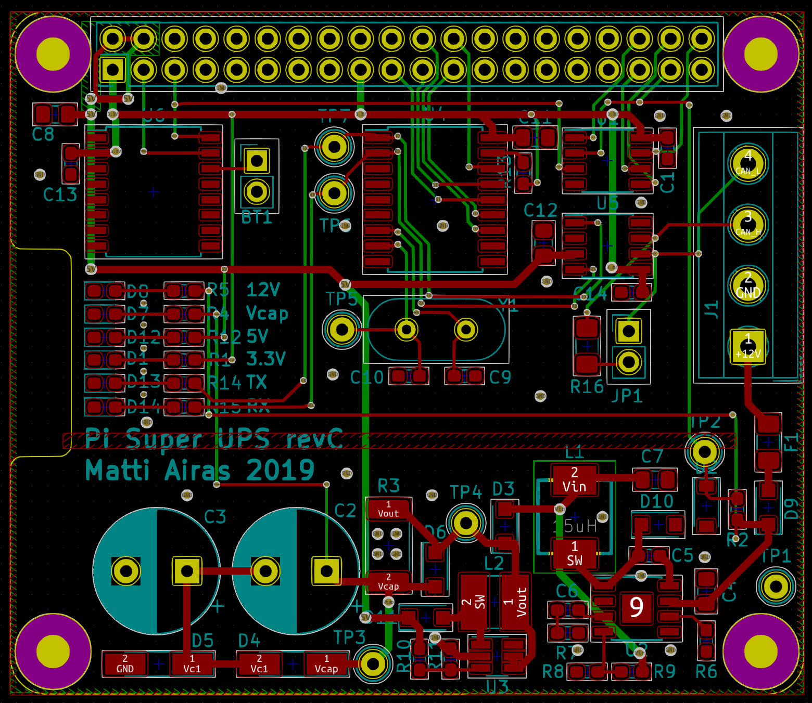

# Pi Super-UPS

## Hardware

TODO: Explain design goals

TODO: Explain features

The KiCad design files are in the `hardware` subdirectory. They are still
untested and no suitability for any purpose is claimed.

## Firmware

The hardware needs some ATTiny13a code to correctly control the
wakeup pin (GPIO3) state. This is still to be written!

## Service software

### Introduction

`pi-super-ups` is a simple power monitor for Raspberry Pi. It
monitors a defined GPIO pin on the Raspberry Pi. If the pin goes
high for ten seconds, a shutdown is triggered. Using GPIO 3 is highly
recommended because that allows for automatic restarting when power
is restored (pulling GPIO 3 low powers on the device if it is powered
off).

The main use case for the script is to have the board powered via
a couple of super-capacitors. In the case power for the board is
disconnected, the supercaps are able to supply sufficient power
that the device is able to shut itself down in a controlled fashion.

A sample circuit fulfilling the purpose is presented in the `circuit`
subdirectory.

### Installation

The monitor script can be installed by issueing the following command
in the `src` subdirectory:

    sudo python3 setup.py install

At this point, you
should already be able to run the script. However, since calling
`poweroff` requires elevated privileges, it is done using `sudo`.
Give your preferred user permissions to call `poweroff` without a
password by running `sudo visudo` and adding the following line:

    pi ALL = NOPASSWD: /sbin/poweroff

Finally, to run the script automatically as a service, copy
`sk_power_monitor.service` to `/etc/systemd/system`.

### Usage

To configure the monitor behavior, directly edit the script file.
