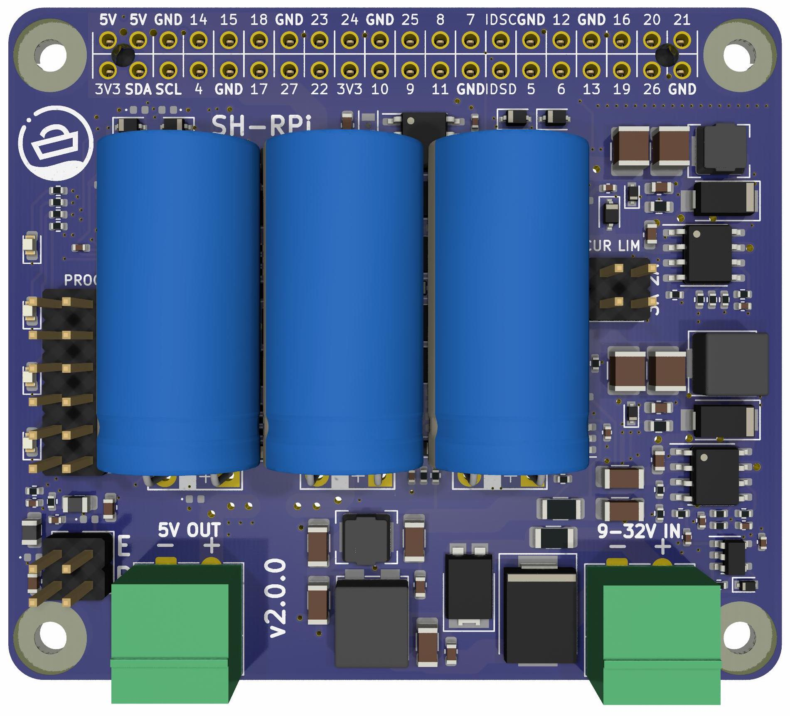

# Sailor Hat for Raspberry Pi (SH-RPi)

## Introduction

The Sailor Hat for Raspberry Pi (SH-RPi) is a versatile power management board designed for the Raspberry Pi and similar single-board computers. With the SH-RPi connected, you can create deeply integrated servers that shut down safely when power is turned off and wake up automatically when power is restored.

SH-RPi supports all Raspberry Pi models with a 40-pin GPIO header (every model since the Pi 1 Model B+). Additionally, it is compatible with Raspberry Pi Compute Module 4 boards and other single-board computers that have a 40-pin Raspberry Pi-compatible GPIO header or an external I2C interface with a 5V power input.

The [documentation site](https://docs.hatlabs.fi/sh-rpi/) has details on the hardware and software features of the board.

This repository contains the KiCad hardware design files for Sailor Hat.
There are two other related repositories: 
[firmware](https://github.com/hatlabs/SH-RPi-firmware) and 
[daemon](https://github.com/hatlabs/SH-RPi-daemon).

The documentation site is at [docs.hatlabs.fi/sh-rpi](https://docs.hatlabs.fi/). The devices are available for purchase at [shop.hatlabs.fi](https://shop.hatlabs.fi).

