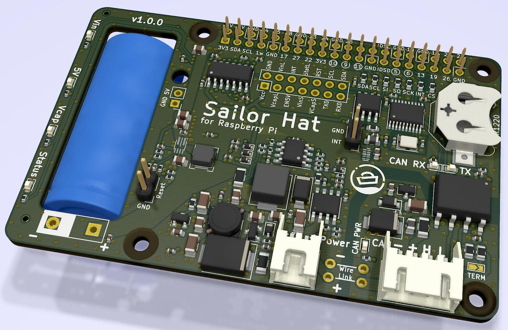

# Sailor Hat for Raspberry Pi (SH-RPi)

## Introduction

Sailor Hat for Raspberry Pi is a Raspberry Pi power management and CAN bus
controller board for marine and automotive use. It allows the Raspberry Pi
to be powered by "noisy" marine and automotive 12-24V electrical systems. It
also allows safe powering of the Raspberry Pi using an NMEA 2000 bus and 
provides "last gasp" functionality, allowing the Raspberry Pi to safely shut
down when the power is cut. SH-RPi can also reboot the computer automatically 
if it no longer pings the hat at given intervals.

The main features are:

- Safe 8-32V power input, enabling use in both 12V and 24V systems without external voltage conversion.
The inputs are protected to withstand different power surges commonly present in the boats' electrical networks.
- Power management using a 2.7V 60F supercapacitor that provides so-called last gasp energy for shutting down the device in a controlled fashion after the system power is cut.
The amount of time the supercap can provide power depends on the SBC power consumption but a 60F supercapacitor can power a Raspberry Pi 4 for 40 seconds which is more than enough for the operating system to safely shut down itself.
- Peak power management: 
The same supercapacitor circuitry is able to provide peak current for power-hungry devices such as the Raspberry Pi 4B, allowing those devices to be powered using current-limited subcircuits such as the NMEA 2000 bus power wires.
- Protection circuitry:
The board is protected against noisy 12-24V voltages commonly present on marine vessels or vehicles.
- An optocoupled CAN bus controller, allowing for NMEA 2000 compliant  connectivity to boat instrument network.
- A battery-powered real-time clock circuit, allowing for the device to keep time even in absence of GPS or internet connection.
- ATtiny1614 microcontroller that controls the board communicates with the computer using I2C and has pins and memory available for custom functionality.

This repository contains the KiCad hardware design files for Sailor Hat.
There are two other related repositories: 
[firmware](https://github.com/hatlabs/SH-RPi-firmware) and 
[daemon](https://github.com/hatlabs/SH-RPi-daemon).

A rendering of v1.0.0 circuit board:

